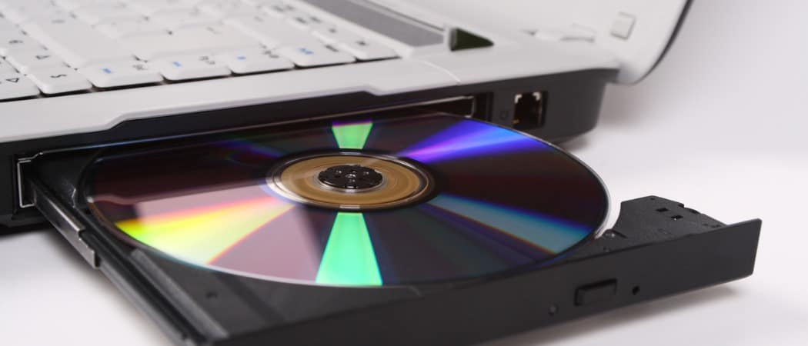

## Install linux (Ubuntu) on a virtualization platform
- In this tutorial, we'll use VmWare Workstation Professional to instll Ubuntu.
- This is not a professional installation guide, it is just a guideline to help you get strted.

#### VmWare workstation Pro

- November 11, 2024: Broadcom announced that [Workstation Pro](https://www.vmware.com/products/desktop-hypervisor/workstation-and-fusion) would be free for all users, including commercial, educational, and personal use.
- To use it, you'll have to create a Broadcom free account to access the download files
- I'll be "talking" to Windows users.  If you are using Mac, you'll need to use Fusion (from the same place).
- Download and install it.

#### Ubuntu version and requirements

- We'll use:  
      [Ubuntu 24.04.4 LTS (Noble Numbat)](https://ubuntu.com/download/desktop)
- This version is:
  - A desktop version (so it has GUI)
  - Has X86-64 (also called amd64), but also ARM version (for Mac users)
  - stable
  - Long Term support by Canonical (support until June 2029)
  - Formal requirements: CPU: dual-core 2GHz, 4Gb-Memory, 25Gn storage, usb/DVD drive for installation
     (use better if you can)
- We'll choose the X86-64 if you are on Windows machines, ARM if you are on a Mac

#### Download image

- Click on the [download button](https://ubuntu.com/download/desktop)
- Download starts immediatelly, so you don't have to register if you don't like to.
- You download an [iso file](https://en.wikipedia.org/wiki/Optical_disc_image) that would be an installation DVD back in the old days.  

- Move the iso file to a dedicated place you create: (say c:\VMs)
- File size is 6.5Gb 

#### Virtual Machine
- Start VmWare Wprkstation pro
- Create a new virtual machine:
  - custom -> offered HW compatibility
  - I will install the operating system later
  - linux -> Ubuntu 64-bit
  - Choose a name for your machine.
  - Leave the default location for the VM.  
(For me:   C:\Users\yuval\Documents\Virtual Machines\Ubuntu 64-bit)
  - Choose: 2 procs, 2 cores per proc if you can(check your computer CPU first)  
Do not assign more than 50% of your total physical cores to a single VM
  - RAM: 8192 if you can (or even more)
  - Network type: NAT
  - I/O controllers (leave defaults)
  - Disk type: SCSI (better performance, support for hot-plug, available drivers in Ubuntu)
  - Create a new virtual disk
  - Disk size: 60GB if you can
  - Allocate now: NO  Split into files: NO
  - Leave the default for the VMDK file
  - Click finish

#### Installation
- Make your VM DVD point to the iso file
- Start your machine
- Click inside the window - choose "Try or install Ubuntu"
- You may need to click ctrl-/
- Go with the defaults - choose "wired" for internet connection
- Skip the "update now" and continut to "install Ubuntu"
- Choose "interractive installation"
- Choose "default selection"
- Don't choose anything else and install
- "Erase disk and install Ubuntu" (no advanced features for now)
- Insert your name (user account) and password, review and complete install
