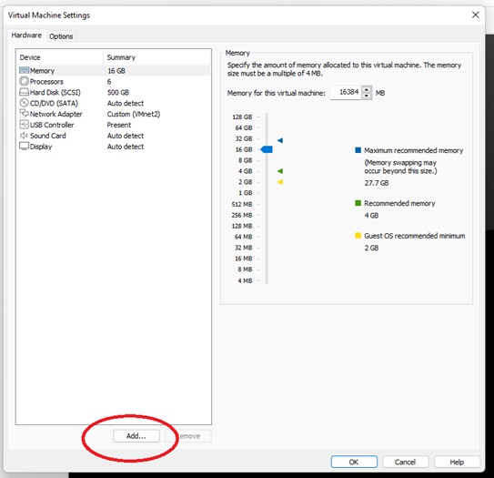
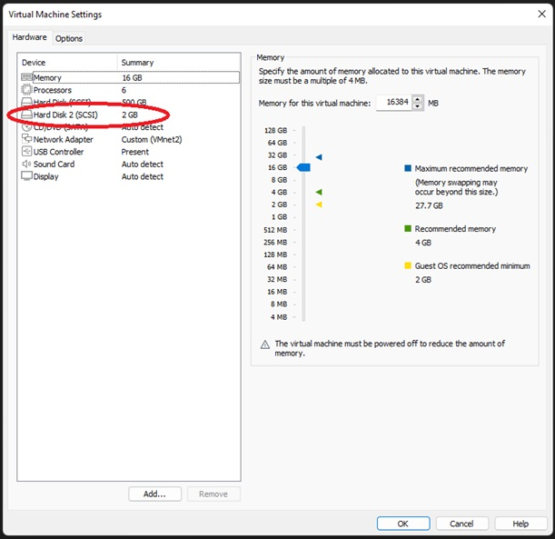

# Playing with Linux mount command - part 2

In this lab we'll create a second disk and add it to our linux system.  
Then we will mount it in our own prefered directory location.


## Creating another disk


- This lab assume you are using VmWare Workstation.
- Stop your linux (shut dowm)
- Click on settings, than click on the **Add** button:  

- Choose type "SCSI", create a new file for it, then specify size as 2G
- You should be able to see the new disk in the list of devices:  


## Showing new disk

- Start your virtual machine again
- List /dev directory to find the new device:
```
ls -l /dev/sdb
```
- Note that your device in not mounted now:  
```
mount | grep sdb
```

## Create a partition and file system

- Find your new disk in the list:
```
sudo fdisk -l
```
- Create a new partition:
```
sudo fdisk /dev/sdb
Command: n                    # new partition
Partition type: p            # primary partition
Partition number: 1          # first partition
First sector: [Enter]        # accept default
Last sector: [Enter]         # use all space
Command: t                   # change partition type
Partition type or alias: b   # W95 FAT32 (common for USB drives)
Command: w                   # write changes
```
- You can see that the partition was created:
```
sudo fdisk -l  | grep sdb
```

### File System

- First, let's check if the partition has a filesystem:
```
sudo file -s /dev/sdb1
```
If it shows "data" instead of a filesystem type, we need to create the filesystem:
```
sudo mkfs.vfat -F 32 /dev/sdb1
```


### Create a new directory and mount
- Create a new directory to mount your new device:
```
mkdir diskB
```
- Use the **mount** command to mount your new disk:
```
sudo mkfs.vfat -F 32 /dev/sdb1
```
- You can now copy files and use the new device.
- If you want to get a "feeling" of that device, you can umount it (un mount), then mount it some other place.
