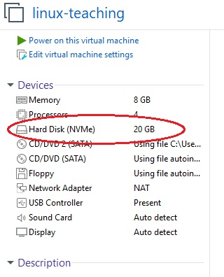
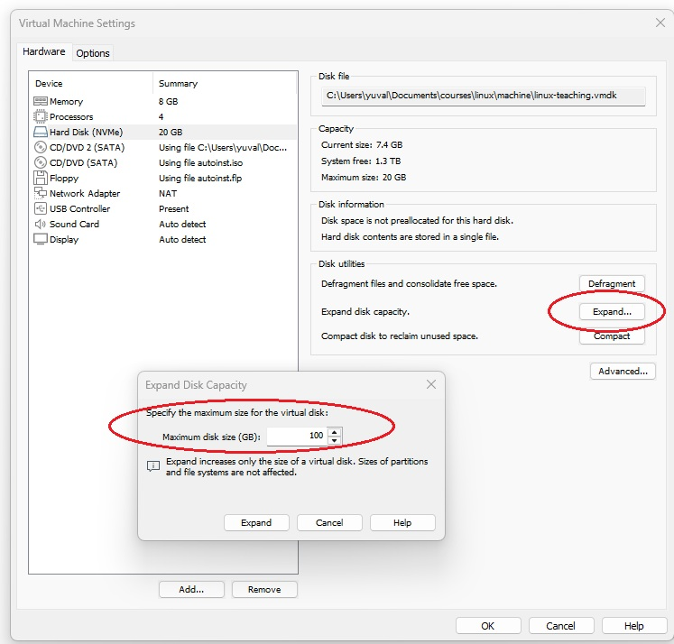

## Extend disk size
In this lab, well:
- Enlarge the "physical disk" (based on a virtual machine)
- Extend a partition to fit the new size
- configure the filesystem inside to fit the new size.

### Extending the disk
- My virtual machine has a 20 GB disk.  
.  
- I am using the VmWare Workstation Pro setting to resize this to 100GB.
  - First - shut down the image
  - The **Expand** button will open a sub window
  - The sub window uses the term **Maximum disk size** which means that this is the physical size, and it is the maximum that partitions can use.
  - 

### Partitioning
#### Looking at my partitioning scheme
- First, let's look at my partitions
- This is how it looks:
```
yuval@yuval-VMware-Virtual-Platform:~$ sudo fdisk -l /dev/nvme0n1 
GPT PMBR size mismatch (41943039 != 209715199) will be corrected by write.
Disk /dev/nvme0n1: 100 GiB, 107374182400 bytes, 209715200 sectors
Disk model: VMware Virtual NVMe Disk
Units: sectors of 1 * 512 = 512 bytes
Sector size (logical/physical): 512 bytes / 512 bytes
I/O size (minimum/optimal): 512 bytes / 512 bytes
Disklabel type: gpt
Disk identifier: 3497DCCF-0853-4101-9A77-784C6A709481

Device         Start      End  Sectors Size Type
/dev/nvme0n1p1  2048     4095     2048   1M BIOS boot
/dev/nvme0n1p2  4096 41940991 41936896  20G Linux filesystem
yuval@yuval-VMware-Virtual-Platform:~$ 
```

In my case, this is telling me:
- Physical disk size is 100GB
- I am using GPT (not MBR) partitioning scheme
- Block size is 512 bytes
- Partition /dev/nvme0n1p1 is 1M (this one actually contains GRUB)
- The main partition is just 20GB

#### Expanding my partition

- Technically, a partition must have contiguous free space immediately following it to be expanded easily.
- In my case, /dev/nvme0n1p2 is the last partition on the disk, so there is nothing "blocking" it from growing into that 80GB of empty space.
- While fdisk can do this, it requires deleting and recreating the partition entry (which is nerve-wracking). 
- The most reliable, "standard" way to handle this on modern Linux systems—especially in cloud and virtual environments—is using **growpart**:
```
@yuval-VMware-Virtual-Platform:~$ sudo growpart /dev/nvme0n1 2 
[sudo] password for yuval: 
CHANGED: partition=2 start=4096 old: size=41936896 end=41940991 new: size=209711071 end=209715166
yuval@yuval-VMware-Virtual-Platform:~$ 
yuval@yuval-VMware-Virtual-Platform:~$ 
yuval@yuval-VMware-Virtual-Platform:~$ sudo fdisk -l /dev/nvme0n1 
Disk /dev/nvme0n1: 100 GiB, 107374182400 bytes, 209715200 sectors
Disk model: VMware Virtual NVMe Disk
Units: sectors of 1 * 512 = 512 bytes
Sector size (logical/physical): 512 bytes / 512 bytes
I/O size (minimum/optimal): 512 bytes / 512 bytes
Disklabel type: gpt
Disk identifier: 3497DCCF-0853-4101-9A77-784C6A709481

Device         Start       End   Sectors  Size Type
/dev/nvme0n1p1  2048      4095      2048    1M BIOS boot
/dev/nvme0n1p2  4096 209715166 209711071  100G Linux filesystem
yuval@yuval-VMware-Virtual-Platform:~$ 
```

#### Fixing the file-system

- Note that now the partition "sees" 100GB
- File system still occupies only 20GB from this space:
```
$ df -h  /dev/nvme0n1p2 
Filesystem      Size  Used Avail Use% Mounted on
/dev/nvme0n1p2   20G  5.8G   13G  32% /
$ 
```
- Another way to see that using the **lsblk** command:
```
$ lsblk -f /dev/nvme0n1p2 
NAME      FSTYPE FSVER LABEL UUID                                 FSAVAIL FSUSE% MOUNTPOINTS
nvme0n1p2 ext4   1.0         5deec172-ca3f-479c-bb82-df663332b3e4   12.8G    29% /
$ 
```
- So I am using 5.8GB out of a total of 20GB, so my ext4 file system does not "see" the complete size.
- The command for ext4 is **resize2fs**
```
$ sudo resize2fs /dev/nvme0n1p2
resize2fs 1.47.0 (5-Feb-2023)
Filesystem at /dev/nvme0n1p2 is mounted on /; on-line resizing required
old_desc_blocks = 3, new_desc_blocks = 13
The filesystem on /dev/nvme0n1p2 is now 26213883 (4k) blocks long.
```
- And now:
```
$ lsblk -f /dev/nvme0n1p2 
NAME      FSTYPE FSVER LABEL UUID                                 FSAVAIL FSUSE% MOUNTPOINTS
nvme0n1p2 ext4   1.0         5deec172-ca3f-479c-bb82-df663332b3e4   88.3G     6% /
$ 
```
Which completes the process.