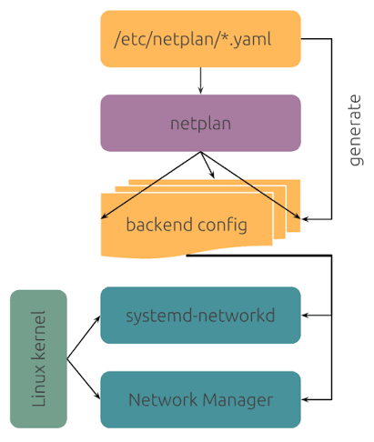

# Who configures the network? (NetworkManager, systemd-networkd, netplan)

A common source of confusion in Linux networking: you edit a configuration, and nothing happens. Usually the reason is simple — **you talked to the wrong manager**. This lesson explains who the players are and how to find out which one runs *your* system.

### The kernel does the work, a manager does the configuration
The actual networking — moving packets, holding IP addresses, routing — is done by the **kernel**. Commands like `ip addr` and `ip route` show the kernel's *current* state, and can even change it:
```
$ sudo ip addr add 192.168.111.50/24 dev ens33
```
But changes made this way are **not persistent** — they vanish on reboot, because nobody wrote them down anywhere.

Persistence is the job of a **network manager**: a service that reads configuration files at boot and applies them to the kernel. On modern systems there are two common managers — and on Ubuntu, an extra layer on top of them.


### Player 1: NetworkManager
- **Where you'll find it:** desktop distributions — Ubuntu Desktop, Fedora, RHEL.
- **Designed for:** dynamic environments — laptops that hop between Wi-Fi networks, VPNs, plugging cables in and out.
- **Configured with:** the `nmcli` command (or the desktop GUI / `nmtui`).
- **Configuration lives in:** `/etc/NetworkManager/system-connections/` — one file per *connection profile*.
```
$ nmcli device status
DEVICE  TYPE      STATE      CONNECTION
ens33   ethernet  connected  Wired connection 1
lo      loopback  unmanaged  --
```
#### Key concept: device vs. connection
NetworkManager separates two ideas:
- A **device** is the actual network interface the kernel sees (`ens33`, `wlan0`). It is the *hardware side*.
- A **connection** is a saved *configuration profile* — a recipe for how to set up a device. It is stored as a file on disk, and exists even when it is not in use.

Is a connection "layer 3"? No — it is not tied to one OSI layer. A connection profile bundles settings from several layers:
- **Layer 2 settings:** Wi-Fi SSID and password, MAC address cloning, MTU, VLAN tags
- **Layer 3 settings:** IPv4/IPv6 method (DHCP or static), addresses, gateway, DNS

Think of it as "everything needed to bring this device into a usable state", not as a network layer.

**Can there be multiple connections for a single device?** Yes — many can *exist*, but only one can be *active* on the device at a time. The classic example is a laptop's Wi-Fi: one device, one profile per network you have ever joined:
```
$ nmcli connection show
NAME            UUID                                  TYPE      DEVICE
home-wifi       f2a6f052-31c8-46f2-8bc3-b0a3a4d1e0cd  wifi      wlan0
office-wifi     8f0f6a2e-6f0e-4b0a-9d3e-2f6a1c9b7d21  wifi      --
cafe-wifi       1d9b8c3a-4e5f-6a7b-8c9d-0e1f2a3b4c5d  wifi      --
```
The `DEVICE` column shows which profile is *currently active* — here `home-wifi` runs on `wlan0`, while the other two are saved but inactive. Each profile carries its own L2 settings (a different SSID and password) **and** its own L3 settings (perhaps DHCP at home, but a static address at the office).

The same trick works for wired interfaces. You could keep two profiles for `ens33` — say `lab-static` and `lab-dhcp` — and switch the whole configuration with one command:
```
$ sudo nmcli connection up lab-static     # ens33 now has the static setup
$ sudo nmcli connection up lab-dhcp       # same device, back to DHCP
```
Activating one profile on a device automatically deactivates the previous one.

Bottom line: `nmcli` commands modify the **connection** (the file on disk); the device just runs whichever profile is active on it.

### Player 2: systemd-networkd
- **Where you'll find it:** Ubuntu **Server**, minimal and cloud images.
- **Designed for:** static environments — servers whose network is configured once and never changes.
- **Configured with:** plain text files (there is a small CLI, `networkctl`, mostly for *inspecting*).
- **Configuration lives in:** `/etc/systemd/network/` — `*.network` files.
```
$ networkctl list
IDX LINK  TYPE     OPERATIONAL SETUP
  1 lo    loopback carrier     unmanaged
  2 ens33 ether    routable    configured
```
`configured` in the SETUP column means networkd owns that interface. (`unmanaged` means it doesn't.)

### Player 3 (Ubuntu only): netplan
netplan is **not a third manager** — it is a translation layer that Ubuntu puts on top of the other two. You write YAML files in `/etc/netplan/`, and on boot netplan *renders* them into configuration for one of the real managers:
```
$ cat /etc/netplan/*.yaml
network:
  version: 2
  renderer: NetworkManager
```
- `renderer: NetworkManager` → NetworkManager manages everything (Ubuntu **Desktop** default).
- `renderer: networkd` — or no renderer line at all → systemd-networkd manages everything (Ubuntu **Server** default).



After editing a netplan file, apply it with `sudo netplan apply`.

**Why this matters:** on Ubuntu Server, `nmcli` may be installed and NetworkManager may even be running — but if netplan renders to networkd, your interface is `unmanaged` from NetworkManager's point of view, and `nmcli` changes will go nowhere.


### Ownership is per-device, not per-system
So far it may sound like a machine picks one manager and that's that. In reality, the rule is finer-grained: **every interface has exactly one owner, but different interfaces can have different owners.** Both NetworkManager and systemd-networkd can be active on the same system at the same time — that is a normal, supported setup, not a misconfiguration — as long as each interface is claimed by only one of them.

A common real-world example: an Ubuntu server where netplan renders `ens33` to systemd-networkd, while NetworkManager is also running and manages a Wi-Fi USB dongle that networkd knows nothing about. Ask each manager and you'll see complementary answers:
```
$ networkctl list
IDX LINK   TYPE     OPERATIONAL SETUP
  2 ens33  ether    routable    configured    ← networkd owns this one
  3 wlan0  wlan     routable    unmanaged     ← ...but not this one

$ nmcli device status
DEVICE  TYPE      STATE       CONNECTION
wlan0   wifi      connected   office-wifi    ← NetworkManager owns this one
ens33   ethernet  unmanaged   --             ← ...and politely stays off this one
```
Each manager marks the other's interface `unmanaged`. Trouble only starts if **both** claim the *same* interface — then they fight over its configuration (each reapplying its own addresses), and the symptoms look like random network flapping.

On Ubuntu, netplan can even do the splitting for you: `renderer:` is not only a global setting — it can be set per interface, sending some devices to networkd and others to NetworkManager:
```
network:
  version: 2
  renderer: networkd          # default for everything...
  ethernets:
    ens33:
      dhcp4: true             # → rendered to systemd-networkd
  wifis:
    wlan0:
      renderer: NetworkManager   # → this one handed to NetworkManager
      access-points:
        office-wifi:
          password: "s3cret"
```
This is why the checklist below asks each manager about *your specific interface*, rather than just asking which services are running.

### So who runs MY system? A checklist
Run these and compare with the table below.

**Check 1 — which manager services are running?**
```
$ systemctl is-active NetworkManager
active
$ systemctl is-active systemd-networkd
inactive
```
(`could not be found` counts as "not running".) Careful: **both can be active at once** — this alone does not settle it.

**Check 2 — who claims your interface?** This is the decisive check. Ask each manager:
```
$ nmcli device status
DEVICE  TYPE      STATE      CONNECTION
ens33   ethernet  connected  Wired connection 1
```
```
$ networkctl list
IDX LINK  TYPE  OPERATIONAL SETUP
  2 ens33 ether routable    unmanaged
```
Whichever manager shows the interface as managed (`connected` for nmcli, `configured` for networkctl) is the one in charge. The other should say `unmanaged`.

**Check 3 (Ubuntu) — what does netplan say?**
```
$ cat /etc/netplan/*.yaml
```
Look for the `renderer:` line as explained above.

**Summary:**

| You see | Conclusion |
|---|---|
| `nmcli`: device `connected` with a connection name | NetworkManager is in charge — use `nmcli` |
| `networkctl`: device `configured` | systemd-networkd is in charge — use `/etc/systemd/network/` files (or netplan on Ubuntu) |
| Ubuntu with `/etc/netplan/*.yaml` present | Configure via netplan YAML, *or* set `renderer: NetworkManager` and use `nmcli` |
| Device `unmanaged` in **both** | Something else (e.g. old `ifupdown`, a cloud agent) — investigate before touching anything |

Once you have confirmed that **NetworkManager** manages your interface, continue to [1-nm-config.md](1-nm-config.md) to actually configure addresses with `nmcli`.
